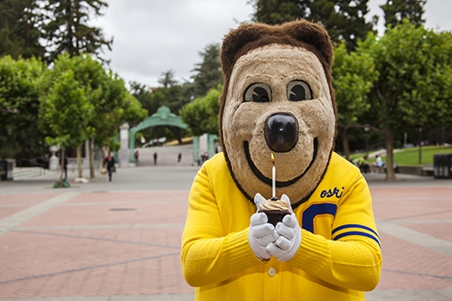

# **Karol Perez** 
*UC Berkeley Student and SEED Scholar* 

Hi, I'm Karol (she/her)! I am passionate about the medical field, history, building/carpentry, and social justice. I wish to explore opportunities to further my knowledge and experience in the medical field as a Biology major at college.

I am a rising freshman at UC Berkeley. Other than academics, I am interested in baking! I enjoy trying new recipes and tasting them. My other hobbies include reading, swimming, and chess.

<iframe width="560" height="315" src="https://www.youtube.com/embed/7QiLe4pTHAE" title="YouTube video player" frameborder="0" allow="accelerometer; autoplay; clipboard-write; encrypted-media; gyroscope; picture-in-picture; web-share" allowfullscreen></iframe>
